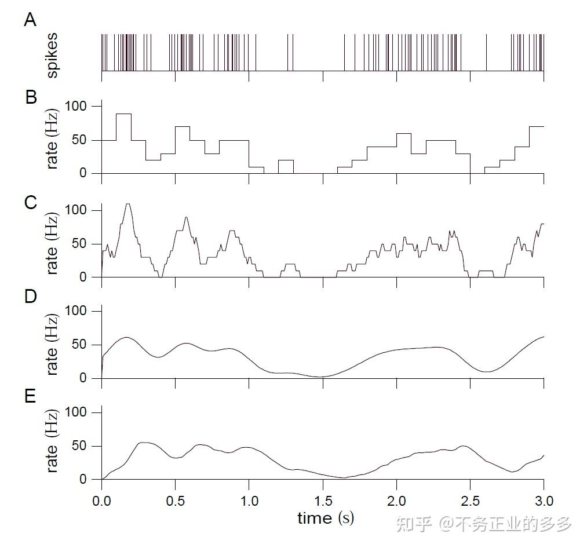
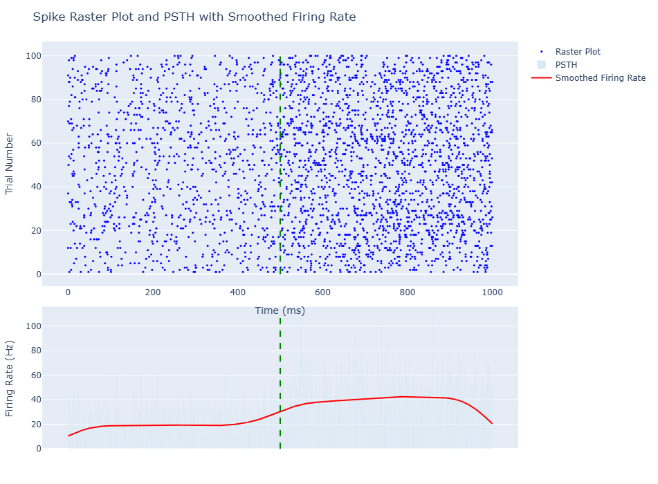
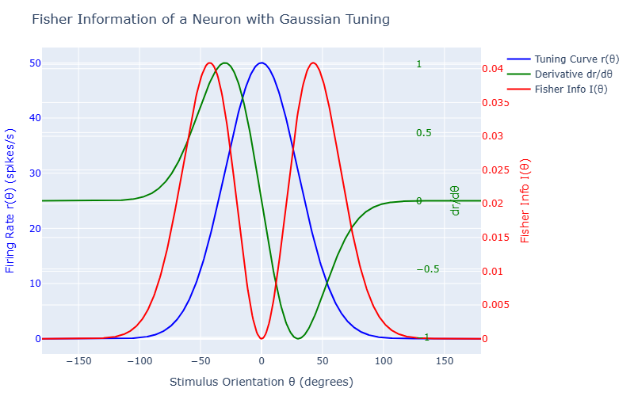
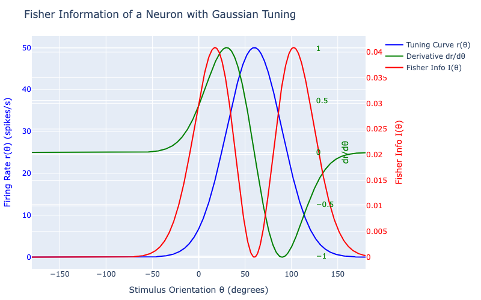
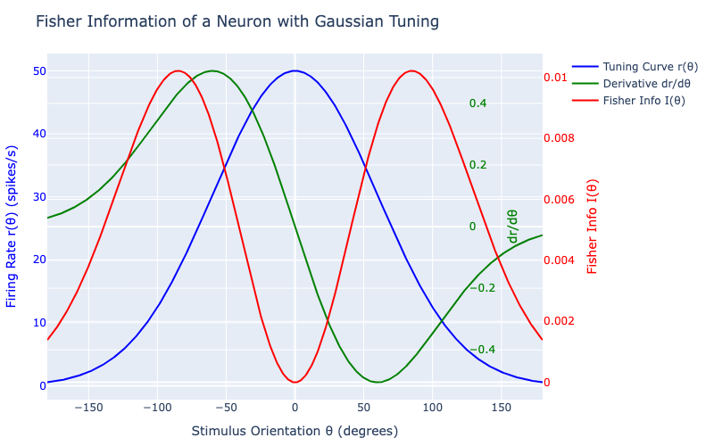

# Spike Train info Discussion
>独宇涵 231880151

参考资料：
- [Chapter 1 Neural Encoding I: Firing Rates and Spike Statistics](https://zhuanlan.zhihu.com/p/627995720)
- [现代计算机图形学基础二：光栅化（Rasterization）](https://zhuanlan.zhihu.com/p/450540827)
- [神经放电时序分析：频率直方图](https://zhuanlan.zhihu.com/p/626497660)

Report目录
- Part one：代码补全与实验结果展示
- Part two：实验结果分析

---

## Part one
### Gaussian kernel(高斯核函数)

Kernel在这里起到的作用可以从上图中直观看出，图中A展示的是原始spike trains，B是简单降低了时间采样率中得到的，B是降低了时间采样率得到的结果，而如果不想丧失时间采样精度则可以使用Kernel对spike trains进行卷积，通过选取不同的Kernel可得到C、D、E等不同平滑曲线

本次实验选用了Gaussian kernel，也是最常用的核函数之一，函数表示为
$$\begin{align}
G[n] &= \frac{1}{\sigma \sqrt{2\pi}}exp(-\frac{(n\Delta t)^2}{2 \sigma^2}) \\
\hat{G}[n] &= \frac{G[n]}{\sum_m G[m]} \\
\hat{r}[n] &= (r*\hat{G})[n] = \sum_{-M}^{M} r[n-m]\hat{G}[m]
\end{align}$$

根据上述公式很容易补全Gaussian_kernel函数，补全后的代码如下所示
```julia
function gaussian_kernel(sigma, dt)
    size = Int(round(6 * sigma / dt))
    if iseven(size)
        size += 1  # Ensure odd size
    end
    x = (-((size - 1) ÷ 2):((size - 1) ÷ 2)) .* dt
    kernel = exp.(-0.5 .* (x ./ sigma).^2) ./ (sigma * sqrt(2 * π))
    kernel = kernel ./ sum(kernel)  # Normalize
    return kernel
end
```

对计算得到的PSTH rate进行高斯卷积平滑处理后得到的结果如下所示


### shannon information
香农信息熵计算公式
$$
Shannon\ entropy = \sum_i -p_i \log(p_i)
$$
由于在神经元放电问题中只存在spike和no spike两种情况，故上述公式也可以简化为
$$
Shannon\ entropy = -p * \log_2(p) - (1-p)*\log_2(1-p)
$$

据此可以补全代码
```julia
function shannon_entropy(p)
    if p == 0.0 || p == 1.0
        return 0.0
    else
        return -p * log2(p) - p_no_spike * log2(p_no_spike)
    end
end
```
补全代码后的运算结果为
```
Probability of spike per bin (across all trials): 0.0301998001998002
Shannon entropy of spike trains: 0.19539285847074153 bits
```

### Mutual Information
Matual Information（MI）是用来衡量两个随机变量之间的互信息量，数学表达式可以写成下面的形式
$$
MI(X;Y) = \sum_{x\in X}\sum_{y \in Y} P(x,y) \log_2 \frac{P(x,y)}{P(x)P(y)}
$$
在本次实验中，使用MI来衡量神经元对刺激的编码效率，如果MI(S;R)较大，说明神经元的放电模式对刺激有很强的区分能力；若MI(S;R)较小，则说明神经元对刺激的相应比较随机。

根据上述公式很容易可以补全代码中的缺失部分
```julia
P_SR = counts ./ total_observations  # Joint probabilities P(S, R)
P_S = sum(P_SR, dims=2)  # Marginal probabilities P(S)
P_R = sum(P_SR, dims=1)  # Marginal probabilities P(R)
```

```julia
# 循环内部：
    P_s_r = P_SR[s, r]
    P_s = P_S[s]
    P_r = P_R[r]
    if P_s_r > 0.0
        MI += P_s_r * log2(P_s_r / (P_s * P_r))
```

补全代码后的运算结果为
```
Mutual Information between stimulus and response: 0.002712589955258319 bits
```

### Fisher Information
Fisher Information是统计学和信息论中的一个重要概念，可以用它来量化一个随机变量的观测值中包含的关于某个参数的信息量，数学定义如下所示
$$
I(\theta) = E[(\frac{\partial}{\partial \theta} \log P(x|\theta))^2]
$$

本次实验中使用Fisher 信息去分析神经元的方向调谐特性
```julia
function r(θ)
    return r_max * exp( - (θ - θ_pref)^2 / (2 * σ^2) )
end
```
定义了一个高斯调谐曲线，描述神经元不同方向的平均放电率
```julia
function dr_dθ(θ)
    return r(θ) * (-(θ - θ_pref) / σ^2)
end
```
定义了谐调曲线对方向theta的导数，表示放电率随方向的变化速率，导数越大表示神经元对方向变化越敏感

根据Fisher信息熵的定义，可以得到如下所示的计算公式，据此公式很容易补全实验代码
$$
I(\theta) = \frac{(\frac{dr}{d\theta})^2}{r(\theta)}
$$

```julia
function fisher_info(θ)
    r_val = r(θ)
    if r_val == 0.0
        return 0.0
    else
        return (dr_dθ(θ))^2 / r_val
    end
end
```

补全后的代码运行结果如图所示


---

## Part two
在Fisher information的计算过程中，我们定义了调谐函数，$\theta_{pref}$决定了调谐函数的中心，而$\sigma$则表示调谐宽度，越小曲线越窄，调谐曲线的双侧峰值在$\theta = \theta_{pref} +/- \sigma \sqrt{2}$处达到，通过改变这两个参数的值我们可以得到不同形状的曲线
比如将曲线的中心值设置为 60 度可以得到如下所示的曲线

而将 $\sigma$ 的值增大一倍则可以让曲线的峰值宽度增大一倍
