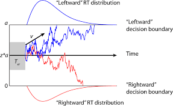
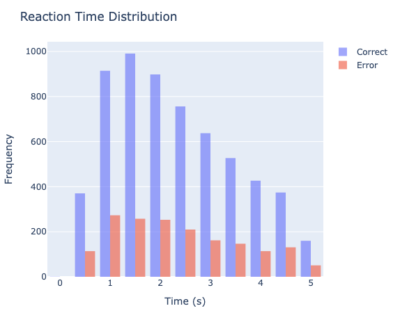
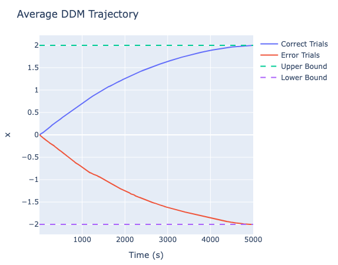
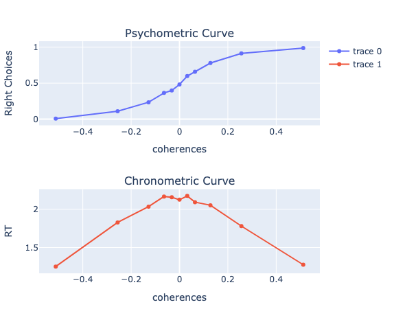

# DDM
>独宇涵 231880151

参考资料：
- [DDM漂移扩散模型与决策的发展](https://zhuanlan.zhihu.com/p/366160160)

目录：
- DDM理论介绍&代码补全
- 实验结果分析

## Part one
Drift Diffusion Model（漂移扩散模型）最初适用于二元决策问题的建模分析，它认为人们的行为决策背后往往存在一个信息收集的过程，当收集到的信息超过某个阈值时决策便产生了

### drift diffusion procession（漂移扩散过程）



假设当前存在两个决策A、B，那么**Drift**代表我们在选择A、B之间的偏好关系，若 drift > 0 则代表选择A、B中我们更偏向于决策A；若 drift < 0 则代表选择A、B中更偏向于决策B。 于drift中确定的方向性不同，**Diffusion**则指没有方向的随机运动过程，表示我们的决策过程也是具有一定随机性的，并不会固定不变。

上述过程可以用数学公式进行符号化表示
$$
dV(t) = Drift\ rate + \epsilon(t)
$$
当$V(t) \geq bar$时，代表选择了决策A；而当$V(t) \leq -bar$时，代表选择了决策B

#### 各参数含义&影响

drift diffusion process curve：可以看作在进行抉择时进行信息搜集的过程，曲线的波动可以看作思考时的纠结过程

Reaction Time Distribution：进行决策所需时间的分布，dirft 偏向的选项的峰值会更高，但是一般来讲两种选项都服从相同的分布函数（这一点可以从实验中的DDM Trajectory中得到验证）

Bar：决策的阈值，阈值增大会增加RT的平均用时，但是并不会对选项的分布产生影响

dirft：漂移率，可以衡量对于A、B之间的偏好，偏移率绝对值越大说明偏好越明显

### 代码实现
根据上面对于DDM的符号化描述，可以很容易构建出DDM的代码实现。在实验背景下A表示correct，B表示error
```julia
function simulate_ddm(k, σ, B, dt, max_t)
    ...
    while abs(x) < B && t_step < max_t_steps
        dx = k * dt + σ * randn() * sqrt(dt) # Euler-Maruyama integration
        x += dx
        xs[t_step] = x
        t_step = t_step + 1
    end
    if x>=B
        r=1
        xs[t_step:max_t_steps] .= B
    elseif x<=-B
        r=-1
        xs[t_step:max_t_steps] .= -B
    end
    ...
end
```
在drift = 0.3、diffusion = `randn(1)`、bar = 2的设置下，RT distribution结果为

Average DDM轨迹可以表示为

```
Accuracy: 0.7794799176107106
Mean RT (correct): 2.345732947976879
Mean RT (error): 2.365566841798013
```
从在drift rate = 0.3时，我们可以得到选择A的概率大概在 78%，我们可以探索不同drift rate 下选择A（correct）的概率的大小
```julia
# drift_rate = 6
# coherences = [-0.512, -.256, -.128, -.064, -.032, 0, +.032, +.064, +.128, +.256, +.512]
for trial in 1:total_trials
    ...
    coh_i = rand(1:n_coherences)
    coh = coherences[coh_i]
    rt, xs, decision = simulate_ddm(drift_rate * coh, σ, B, dt, max_t*2)
    ...
```

可以看出当drift rate的绝对值增大时，选择A（correct）或者B（error）的概率都显著增加（参见Psychometric Curve），而且决策所需要的时间Reaction Time也随之减少